# GW2Icon

GW2Icon is an icon font written in pure CSS3. It allows you to easily include Guild Wars 2 icon in your pages.

## Installation

Put `css/gw2icon.min.css` in your `css/` folder and `img/gw2icon/` in your `img/` folder.  
Then, in your header, just add:

```html
<link rel="stylesheet" href="/path/to/css/gw2icon.min.css" />
```

## Usage

To include an icon in your page, write:

```html
<i class="gw2-gold-coin"></i>
```

## Icons

### Currencies

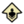 hero-point  
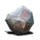 aetherium  
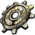 airship-part  
 ascalonian-tear    
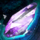 ascended-shard-of-glory  
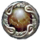 badge-of-honor  
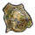 bandit-crest  
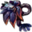 deadly-bloom  
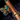 destroyed-matrix-cube-key  
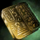 elegy-mosaic  
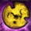 exalted-key  
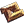 favor  
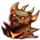 flame-legion-charr-carving  
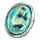 fractal-relic  
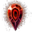 gaeting-crystal  
 geode  
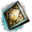 guild-commendation  
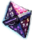 knowledge-crystal  
 laurel  
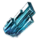 ley-line-crystal  
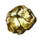 lump-of-aurillium  
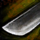 machete  
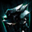 magnetite-shard  
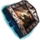 manifesto-of-the-moletariate  
 pact-crowbar  
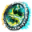 pristine-fractal-relic  
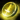 proof-of-heroics  
 provisioner-token  
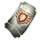 pvp-league-ticket  
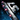 rolan-master-key  
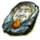 seal-of-beetletun  
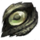 shard-of-zhaitan  
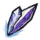 spirit-shard  
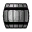 supply  
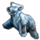 symbol-of-koda  
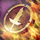 testimony-of-heroics  
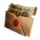 trade-contract  
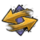 transmutation-charge  
 unbound-magic  
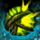 vial-of-chak-acid  
 volatile-magic  
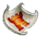 wvw-tournament-claim-ticket  
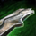 zephyrite-lockpick  
 karma  
 gem  
 copper-coin  
 gold-coin  
 influence

### Menu

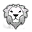 black-lion-menu-bar  
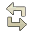 black-lion-panel-currency-exchange  
 black-lion-panel-gem-store  
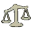 black-lion-panel-trading-post  
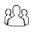 contacts-menu-bar  
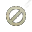 contacts-panel-blocked  
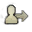 contacts-panel-followers  
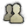 contacts-panel-friends  
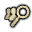 contacts-panel-lfg  
 game-menu-edit-account  
 game-menu-exit  
 game-menu-log-out  
 game-menu-options  
 game-menu-return  
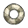 game-menu-support  
 guild-panel-main  
 guild-panel-menu-bar  
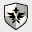 guild-panel-missions  
 guild-panel-ranks  
 guild-panel-roster  
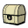 guild-panel-storage  
 guild-panel-teams  
 hero-panel-achievements  
 hero-panel-build  
 hero-panel-crafting  
 hero-panel-equipment  
 hero-panel-masteries  
 hero-panel-menu-bar  
 hero-panel-story-journal  
 hero-panel-training  
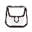 inventory-menu-bar  
 mail-menu-bar  
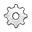 options-menu-bar  
 pvp-menu-bar  
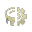 pvp-panel-custom-arena  
 pvp-panel-game-browser  
 pvp-panel-home  
 pvp-panel-league  
 pvp-panel-reward-tracks  
 support-panel-bug-report  
 support-panel-main  
 wvw-menu-bar  
 wvw-panel-detailed-score  
 wvw-panel-mist-war  
 wvw-panel-rank-and-abilities

## Credit

[CSS Sprites](http://css.spritegen.com/) for the sprite generation.

Icons are © 2015 ArenaNet, Inc. All rights reserved.